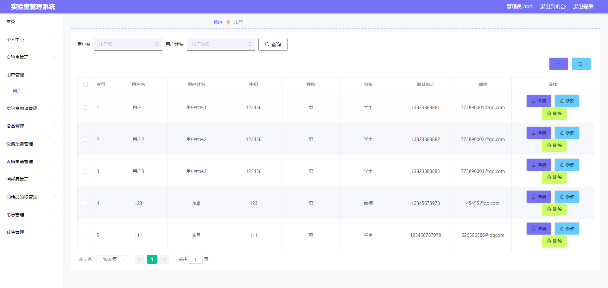

# 1 项目介绍
基于SSM+Vue的实验室管理系统：后端 SpringBoot、Mybatis-Plus，前端Vue+ElementUI，具体功能如下：
## 管理端
- 个人中心：查看和修改个人信息、修改密码
- 用户管理
- 实验室管理
- 实验室申请管理
- 设备管理
- 设备报备管理
- 设备申请管理
- 消耗品管理
- 消耗品领取管理
- 论坛管理
- 系统管理(轮播图管理、新闻资讯、客服管理)

## 用户端
- 实验室展示
- 设备展示
- 消耗品展示
- 论坛信息
- 新闻资讯
- 个人中心
- 在线客服
# 2 系统运行截图
## 2.1 用户登录

## 2.2 查看实验室

## 2.3 查看设备

## 2.4 论坛信息

## 2.5 实验室管理

## 2.6 用户管理

## 2.7 实验室申请

## 2.8 万字文档

## 2.9 PPT

# 3 数据库设计

# 4 源码数据库获取(收费)

